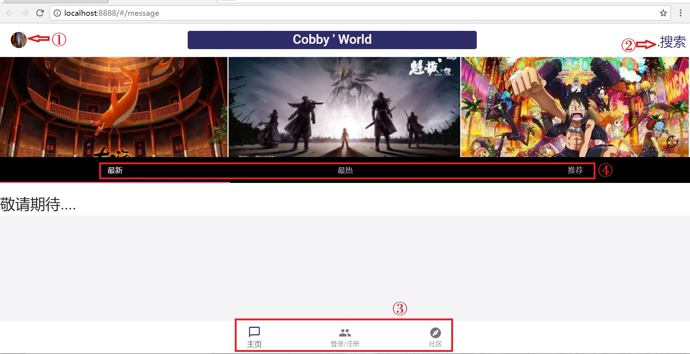
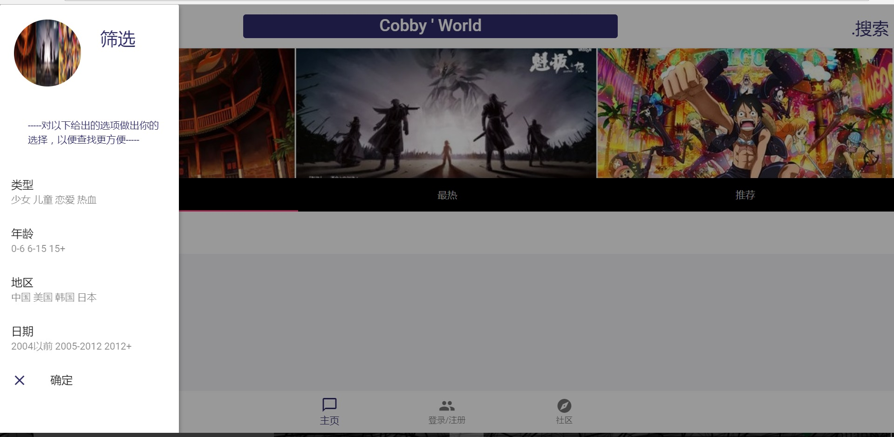
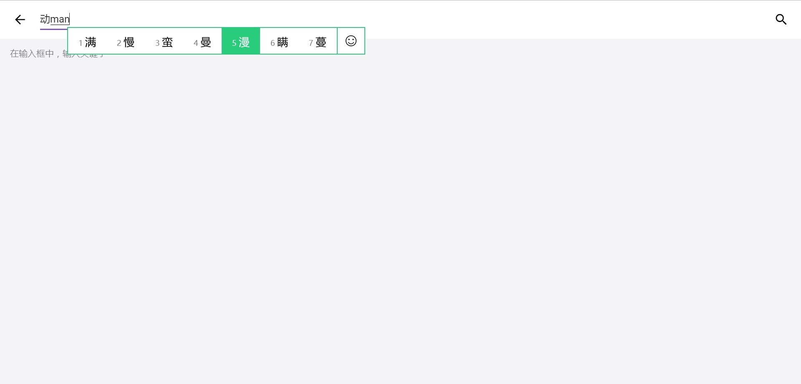
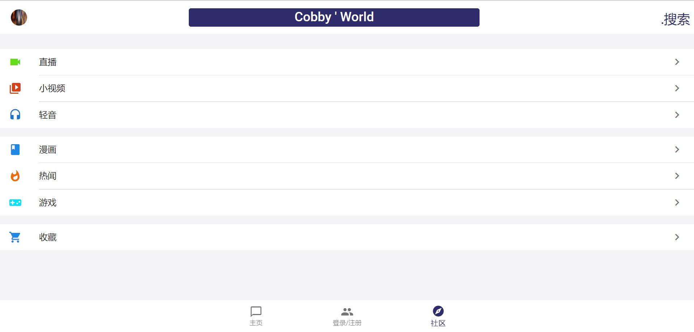

## vue-project

这个project是我基于在网上找的别人写的项目而改编成的

项目地址 `https://github.com/jiangqizheng/vue-MiniQQ`
但是项目中仍存在许多的不足之处需要改善。

### 项目的主界面为

### 一些按钮功能
#### 主界面上的标号 ①

#### 标号②

#### 标号③

#### 标号④
   更改成不同的界面
## 运行步骤
### 进入文件夹
cd vue2-MiniQQ-master
### 安装
npm install
### 运行（端口8888）
npm run dev

